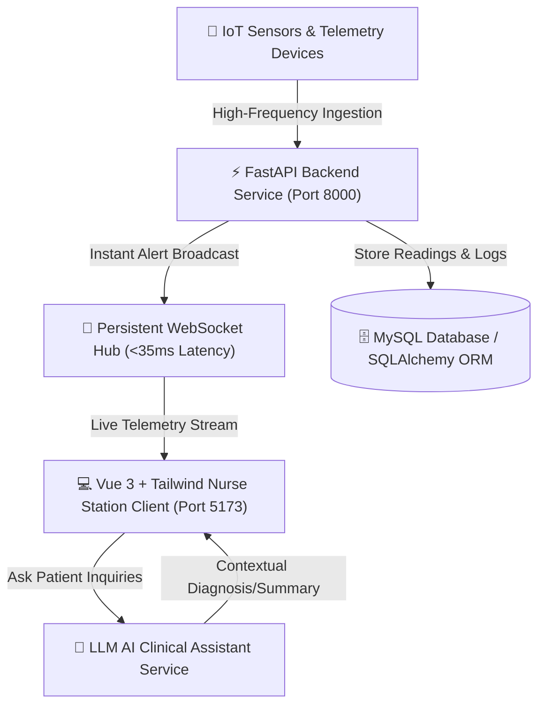

# 🏥 Real-Time Patient Movement & Sensor Monitoring System

[](https://fastapi.tiangolo.com/)
[](https://developer.mozilla.org/en-US/docs/Web/API/WebSockets_API)
[](https://vuejs.org/)
[](https://www.mysql.com/)
[](https://fastapi.tiangolo.com/)

An enterprise healthcare telemetry and patient safety platform engineered to monitor real-time hospital room sensor streams (patient movement, fall detection, vital signs), broadcast sub-35ms emergency alerts to nurse stations over persistent WebSockets, and provide an integrated **LLM AI Clinical Assistant** for rapid patient condition inquiries.

---

## 👨‍💻 My Core Contributions & Engineering Ownership

> **Role**: Full-Stack Developer & Real-Time API Architect  
> **Author**: Phattharaphon Jansanga ([@MatTew-png](https://github.com/MatTew-png) | `65160078@go.buu.ac.th`)

In this project, I architected and implemented the core telemetry processing, nurse alert engine, sensor data visualization, and AI assistant services:

### 1. 📈 Real-Time Sensor Graphs & Timeline Visualization
- Engineered responsive live telemetry graphs (`BedSensorGraph`, `SensorGraphOther`) plotting continuous patient vital and movement sensor streams.
- Developed historical sensor query filters and timeline navigation allowing medical staff to inspect past patient events by date and time.

### 2. 🚨 Emergency Nurse Alert & Notification Engine
- Developed the critical alert dispatch system (`Set Alert Component`, `Notification & Log Relations`) triggering immediate visual and sound alarms during abnormal sensor readings or fall events.
- Built bulk triage actions for nurse stations: **"Accept All"** and **"Resolve / Success All"** with audit log persistence.

### 3. 🤖 LLM AI Clinical Assistant Integration (`AiAsk`)
- Designed and integrated the **LLM AI Assistant Service (`llm AiAsk`)** in Vue 3 and FastAPI, enabling nurses and physicians to ask natural language questions regarding patient history, sensor trends, and room notes.

### 4. ⚡ High-Throughput REST & Telemetry APIs
- Constructed asynchronous FastAPI endpoints for sensor history retrieval (`get_value_sensor`, `sensor history API`).
- Developed hospital bed configuration APIs (`PATCH selectedShowSensorId in beds`) allowing dynamic mapping between physical IoT sensors and patient beds.

### 5. 🏥 Multi-Ward & Hospital Bed Hierarchy
- Designed relational schemas and CRUD interfaces linking Buildings $\rightarrow$ Floors $\rightarrow$ Wards $\rightarrow$ Rooms $\rightarrow$ Beds $\rightarrow$ Sensors $\rightarrow$ Assigned Medical Staff.

---

## 🏗️ System Architecture (C4 Model)



---

## 📐 System Analysis & Design Artifacts

| Document / Artifact | Category | Direct Link |
| :--- | :--- | :--- |
| **🎨 UI/UX Design System** | Figma Prototype | [Figma Design File](https://www.figma.com/design/B3oC8CcWBpeUV0S0GJKWm0/Ui-%E0%B8%A3%E0%B8%B0%E0%B8%9A%E0%B8%9A%E0%B8%95%E0%B8%B4%E0%B8%94%E0%B8%95%E0%B8%B2%E0%B8%A1%E0%B8%9C%E0%B8%B9%E0%B9%89%E0%B8%9B%E0%B9%88%E0%B8%A7%E0%B8%A2%E0%B8%9C%E0%B9%88%E0%B8%B2%E0%B8%99%E0%B9%80%E0%B8%8B%E0%B8%99%E0%B9%80%E0%B8%8B%E0%B8%AD%E0%B8%A3%E0%B9%8C%E0%B9%83%E0%B8%99%E0%B8%AB%E0%B9%89%E0%B8%AD%E0%B8%87%E0%B8%9C%E0%B8%B9%E0%B9%89%E0%B8%9B%E0%B9%88%E0%B8%A7%E0%B8%A2?node-id=197-650&p=f&t=htmq72h5vSGGPuFM-0) |
| **📊 Project Presentation** | Slide Deck | [Canva Presentation](https://www.canva.com/design/DAGeO_aA0cs/pS2S3Azgz4snI0YbM099cw/edit) |
| **🗺️ User Journey & Scenario** | Miro Board | [Miro Scenario Board](https://miro.com/welcomeonboard/TkFOdUNaaUl3OXNMZjFleENod2ZqM0NFSmtlQkRwTkpwUmh2YlV4VDg4YTJNS0lwU3ZndWhDZ2w2dlh4ZXFMeXJ4emNFUDFidjdlbXByelVtaG9HOHF4TlI3WGNWYU1FN1FGbXVzbHVvZG9Zc3JiaHV6ZHZWeUtYclZ0VWk4RzZ3VHhHVHd5UWtSM1BidUtUYmxycDRnPT0hdjE=?share_link_id=249412923020) |
| **🏛️ C4 Model Architecture** | Context / Container / Component | [C4 Model PDF](https://drive.google.com/file/d/19GWwGfqNgAInRoPGy2qINqxX2vTdrmZN/view?usp=sharing) |
| **🗂️ Entity Relationship (ERD)** | Database Schema | [ERD Diagram](https://drive.google.com/file/d/1uBi9ysVAQxPKz4XcvDt6rTuRZco35s93/view?usp=sharing) |
| **🧩 Class Diagram** | OOP Architecture | [Class Diagram](https://drive.google.com/file/d/1-27TwOA5XsRmiE0xfUXeArxDG3U8sl8m/view) |
| **🔄 Sequence Diagram** | Real-time Alert Flow | [Sequence Diagram](https://drive.google.com/file/d/159g6gSR82VvqbHVXhth5wVdsE0za28lB/view?usp=sharing) |
| **📋 Use Case Description** | Requirements Specs | [Use Case Document](https://docs.google.com/document/d/1UJCMffcfJZjCBJPqsgEOVc_KPSHDcEdb_36hLQJEu8E/edit?usp=sharing) |
| **📖 Data Dictionary** | Field Definitions | [Data Dictionary Sheet](https://docs.google.com/spreadsheets/d/1RC7gSTfdsqcS3m2-YGRNzwDaZnBxEbYRzZbSEInUUfM/edit?usp=sharing) |

---

## 🧪 Quality Assurance & Testing Suite

| Testing Document | Scope | Direct Link |
| :--- | :--- | :--- |
| **📑 Test Plan** | UAT & System Integration Strategy | [Test Plan Spreadsheet](https://docs.google.com/spreadsheets/d/1km_5wmkD6w4EPZa-URQ7j7NEBSt6trFH/edit?usp=sharing) |
| **🧪 Test Cases** | Functional & Edge Case Matrices | [Test Cases Spreadsheet](https://docs.google.com/spreadsheets/d/1ysHoxwoHfNrWQhZPry0fzp2i54kT_VRAnpZM9eDSVDA/edit?usp=sharing) |
| **📝 Test Scripts** | Step-by-Step Execution Verification | [Test Scripts Spreadsheet](https://docs.google.com/spreadsheets/d/1GUvV1rj9QRxr29UI7Xis4lcBY-_MfUHH7Nv85b3oafU/edit?usp=sharing) |
| **📕 UAT Acceptance Report** | User Acceptance Testing & Signoff | [UAT Drive Folder](https://drive.google.com/drive/folders/1XKamhkXijoVzNoRdvDhMJHL3t5SYpkzl?usp=sharing) |

---

## 🚀 Quick Start Guide

### Prerequisites
- Python 3.10+
- Node.js >= 18
- MySQL 8.0+

### 1. Setup Backend
```bash
cd backend
python -m venv venv
source venv/bin/activate  # On Windows: venv\Scripts\activate
pip install -r requirements.txt
uvicorn app.main:app --reload --port 8000
```
- 🔌 **API Documentation (Swagger UI)**: [http://localhost:8000/docs](http://localhost:8000/docs)

### 2. Setup Frontend
```bash
cd frontend
npm install
npm run dev
```
- 🌐 **Nurse Station Client**: [http://localhost:5173](http://localhost:5173)

---

## 📄 Author & Credits
- **Phattharaphon Jansanga** — Full-Stack Developer & Real-Time API Specialist
- GitHub: [@MatTew-png](https://github.com/MatTew-png)
- Email: `jansanga.new@gmail.com`
